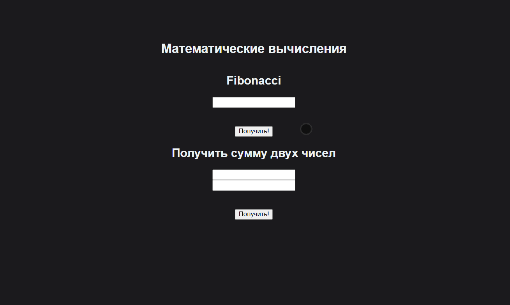

## Express-nodejs
Реализована возможность расчитывать на сервере число фибоначи и складывать 2 чилса.
Использовал proxy для API на дев сервере

<pre>
  devServer: {
      proxy: {
        '/api': {
          target: 'http://localhost:3001',
          pathRewrite: { '^/api': '' },
        },
      },
    },
</pre>



#
## Проект сожержит

<details>
  <summary >TypeScript</summary>

  [Что это?](https://www.typescriptlang.org/)

    TypeScript is JavaScript with syntax for types.
    TypeScript is a strongly typed programming language that builds on JavaScript, giving you better tooling at any scale.


</details>
<details>
  <summary >Node JS</summary>

  [Что это?](https://nodejs.org/en/)

    Node.js® — это JavaScript-окружение построенное на движке Chrome V8.

    Запущен на localhost:3001

</details>

<details>
  <summary >Express</summary>

  [Что это?](https://expressjs.com/ru/

    Express
    Быстрый, гибкий, минималистичный веб-фреймворк для приложений Node.js

</details>


<details >
  <summary >Create-layer</summary>
 
  [Что это?](https://github.com/Nelkor/create-layer) 
 
   Используя create-layer, мы создаём основу для нового проекта.
</details>

<details>
  <summary >Vue</summary>

  [Что это?](https://vuejs.org/)

    Прогрессивный JavaScript-фреймворк

</details>

<details>
  <summary>SCSS</summary>
 
  [Что это?](https://sass-scss.ru/)  
  Препроцессор css
</details> 


<details>
  <summary>Локальный сервер</summary>
 
  [Что это?](https://ru.wikipedia.org/wiki/Localhost) 
 
  По умолчанию [localhost:5445](http://localhost:5445).
</details>


# 
## Для запуска потребуется
- этот репозиторий 
 ```
git clone https://github.com/VladislavBobyrev/
```
- node.js 
 
```
https://nodejs.org/en/
```

- браузер

#
## Команды

|                        |                       |
|------------------------|:----------------------|
| Установить зависимости | `npm i`               |
| Запустить локально     | `npm run serve`       |
| Собрать                | `npm run build`       |
| Заустить lint          | `npm run lint`        |
 
#
## Связвться со мной
<div align='center'> 
 
 ```
vladislavbobyrev@yandex.ru
```
 
 [](https://t.me/VladislavBobyrev)

 </div>
 
<div align="center">
  <h2>**ВНИМАНИЕ!**  Вся конфигурация является открытой. </h2>
 
**ВНИМАНИЕ!** На компьютере должны быть установлены программы `node` и `npm`.
Генерация  занимает много времени за счёт
установки `node_modules`. Необходимо дождаться окончания этого процесса.
 
</div>
